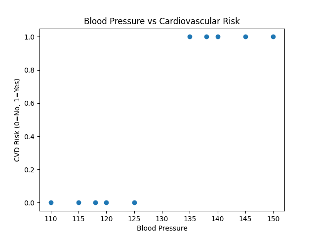

# Migraine-CVD-Risk-Model
A Python data analysis project exploring the relationship between Migraine and Cardiovascular Disease (CVD) risk using statistical analysis and data visualization.
## Project Overview
This project analyzes the relationship between Migraine and Cardiovascular Disease (CVD) risk using Python.

## Technologies Used
- Python
- Pandas
- Matplotlib

## Features
- Data analysis
- Correlation calculation
- Risk comparison
- Data visualization

## Sample Output

